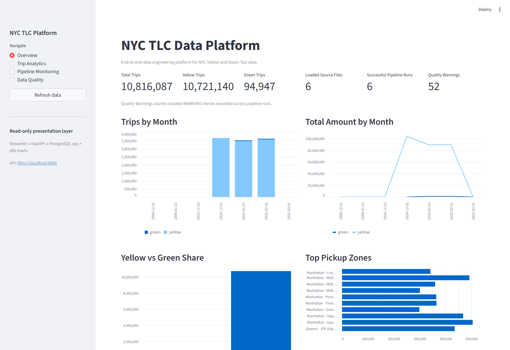
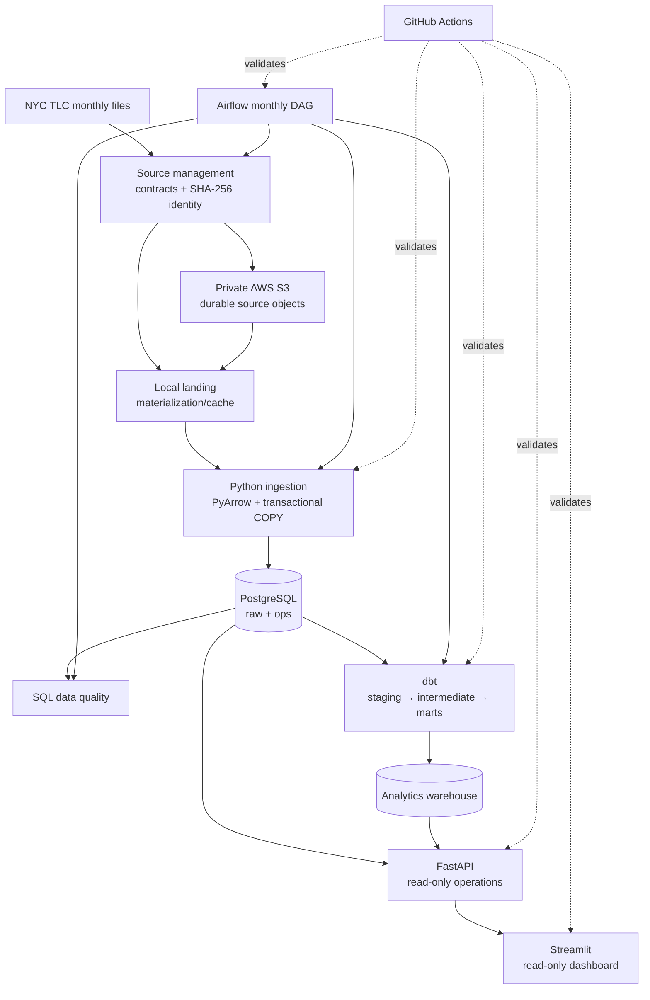
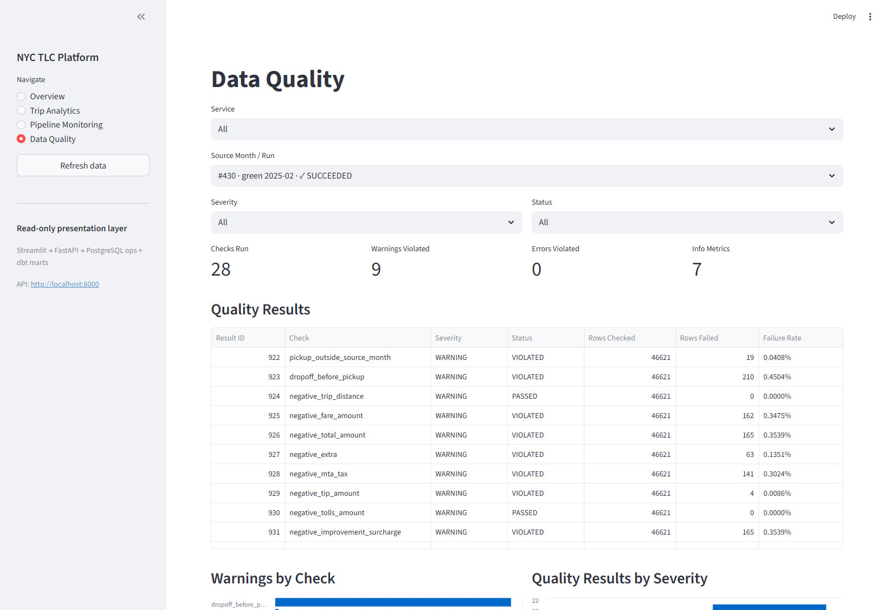
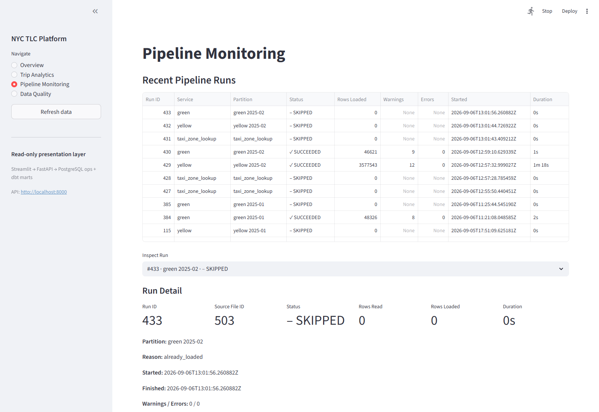
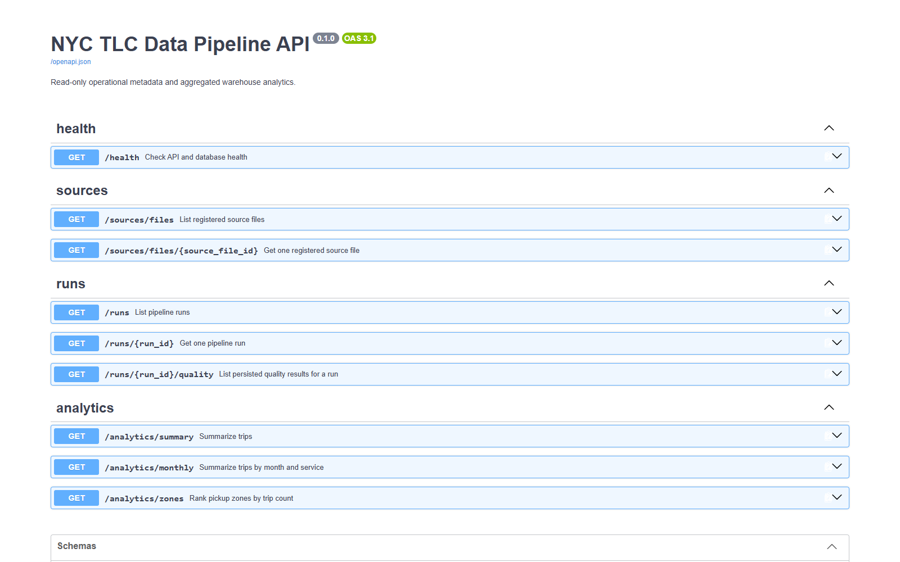

# NYC TLC Data Pipeline & Quality Platform

An end-to-end data engineering platform for monthly NYC TLC Yellow and Green Taxi
Parquet files. It validates source contracts, loads PostgreSQL transactionally, tracks
file and run lineage, persists SQL data-quality results, transforms data with dbt,
orchestrates monthly workflows with Airflow, exposes read-only analytics through FastAPI,
and presents the platform in Streamlit. An optional S3 backend durably stores immutable
source artifacts without replacing the local ingestion path.



## Architecture



Responsibility boundaries stay explicit: Airflow orchestrates, Python owns source/raw
operations, dbt owns analytical transformations, FastAPI is the access layer, and
Streamlit only visualizes API responses. See [the architecture notes](docs/architecture.md).

## Key features

- Monthly Yellow and Green ingestion with exact schema contracts and additive Yellow
  schema evolution.
- Transactional PostgreSQL `COPY` loading in bounded PyArrow batches.
- Source version identity from logical partition plus SHA-256, with idempotent reruns and
  blocked source revisions.
- Deterministic source-file, source-row, and pipeline-run lineage.
- Set-based SQL quality checks that preserve source anomalies and persist counts, rates,
  severities, and details.
- dbt staging, shared multi-service canonical models, dimensions, and incremental fact
  loading.
- Thin Airflow 3 monthly orchestration using the same independently runnable services.
- Read-only FastAPI operational and aggregate analytics endpoints.
- Read-only Streamlit pages for overview, analytics, pipeline monitoring, and quality.
- Optional private S3 storage with checksum-addressed keys and verified recovery.
- Layered unit, PostgreSQL integration, dbt, DAG, API, dashboard, and end-to-end tests.

## Data flow and contracts

Official TLC files land unchanged under `data/landing/` and are identified by SHA-256.
Structural errors stop loading; row-level anomalies become persisted warnings or metrics
and remain in raw. The raw layer preserves TLC names and nullable source values. dbt then
renames and combines Yellow and Green into one canonical trip model before loading the
small dimensional warehouse.

The profiled reproducibility baseline contains 7,191,923 Yellow and Green fact rows. The
source evidence and exact contracts are documented in
[the profiling report](reports/data_profiling/PROFILING_REPORT.md) and the Green
[integration report](reports/data_profiling/GREEN_2025_01_REPORT.md).

## Warehouse model

```text
                    dim_date
                       |
        dim_zone --- fct_trips --- dim_vendor
                       |
                    dim_zone
             pickup role / dropoff role
```

`fct_trips` is incremental by loaded source-file identity. Key-zero `Unknown` members
preserve facts with unresolved dimension references. Small version-controlled seeds map
vendor, rate, and payment codes; original numeric codes and technical lineage remain on
the fact.

## Data quality

Checks are service-aware and SQL-first. They cover pickup month alignment, reversed
durations, negative source values, nullable/zero-value metrics, documented code domains,
Taxi Zone references, and collision-safe exact duplicates. `INFO`, `WARNING`, and
`ERROR` describe rule severity; `passed` and `violated` describe outcomes. Warning/error
counters count violated checks, not failing rows.



## Airflow, API, and dashboard

The `tlc_monthly_pipeline` DAG resolves one month, ensures Taxi Zones, processes Yellow
and Green sequentially, runs quality, then executes `dbt build`. Reruns visibly record
`skipped / already_loaded` attempts while downstream quality and dbt remain current.

FastAPI reads `ops` metadata and aggregate `marts` data; it has no write or workflow
control endpoints. Streamlit reads FastAPI only, uses a 45-second GET cache, and handles
API downtime and empty selections without exposing tracebacks or credentials.





## Optional AWS S3 storage

`LANDING_BACKEND=local` remains the default. In S3 mode, validated sources are stored at
keys such as `landing/yellow/2025/01/<sha256>.parquet` in one private, versioned,
encrypted bucket. Existing matching objects are reused; metadata or size conflicts fail.
Recovery downloads to a partial file, verifies full SHA-256, then atomically restores the
normal local landing path. ETag and S3 Version ID never replace application checksum
identity. See [the S3 guide](docs/aws_s3.md).

## Performance

Phase 13 benchmarked an isolated 7.19-million-row warehouse on a documented local Windows
machine. Yellow January COPY trials measured roughly 30,556–34,358 rows/second across
25k–250k batch sizes, which did not justify changing the 50,000-row default. Query plans
supported one dbt-owned B-tree on pickup date/service plus post-build statistics. A measured
BRIN trial did not improve the workload enough to justify its cost, while table partitioning
was evaluated and not justified at the current scale and access patterns. These local
measurements are evidence, not production SLAs. Full results and plans are in
[the performance report](docs/performance/BASELINE.md).

## Technology stack

Python, SQL, PostgreSQL, PyArrow, pandas, SQLAlchemy, Alembic, psycopg, dbt Core,
Apache Airflow, FastAPI, Streamlit, boto3/AWS S3, pytest, Ruff, Docker Compose, Git, and
GitHub Actions.

## Local setup

Requirements: Python 3.11+, Docker Compose, and Git. Run commands from the repository
root. Copy the example configuration using your shell:

```bash
cp .env.example .env
```

```powershell
Copy-Item .env.example .env
```

Edit `.env` to configure the project and replace every local secret placeholder. Keep
the example's unquoted `KEY=value` format. Ensure `DATABASE_URL` matches your PostgreSQL
settings, URL-encoding password characters where needed in that URL.

Load the values into the **current shell before running Alembic or application commands**.
These loaders preserve values literally; Alembic does not load `.env` automatically.

Bash-compatible shells:

```bash
while IFS= read -r entry || [ -n "$entry" ]; do
  entry=${entry%$'\r'}
  if [[ "$entry" =~ ^[A-Za-z_][A-Za-z0-9_]*= ]]; then
    export "$entry"
  fi
done < .env
```

PowerShell:

```powershell
Get-Content .env | ForEach-Object {
    if ($_ -match '^([A-Za-z_][A-Za-z0-9_]*)=(.*)$') {
        [Environment]::SetEnvironmentVariable($Matches[1], $Matches[2], 'Process')
    }
}
```

Then, in that configured shell (either Bash or PowerShell):

```bash
python -m pip install -e ".[dev]"
docker compose up -d --wait postgres
alembic upgrade head
```

Build the warehouse after loading sources:

```bash
python -m taxi_pipeline ingest-zones
python -m taxi_pipeline ingest --service yellow --year 2025 --month 1
python -m taxi_pipeline quality run --service yellow --year 2025 --month 1
python -m taxi_pipeline ingest --service green --year 2025 --month 1
python -m taxi_pipeline quality run --service green --year 2025 --month 1
dbt build --project-dir dbt/taxi_analytics --profiles-dir dbt/taxi_analytics
```

Start the read-only interfaces in separate shells. Load `.env` using the corresponding
loader above in the FastAPI shell before starting it:

```bash
uvicorn taxi_pipeline.api.app:app --reload --port 8000
streamlit run src/taxi_pipeline/dashboard/app.py
```

`API_BASE_URL` defaults to `http://localhost:8000`; Streamlit needs no database or AWS
credentials. Initialize the local Airflow environment with `docker compose up airflow-init`,
then start `airflow-api-server`, `airflow-scheduler`, and `airflow-dag-processor` as shown
in [the demo guide](docs/DEMO.md).

## Testing and CI

Use a dedicated PostgreSQL test database—never the development database—through
`TEST_DATABASE_URL`. The configured test role needs `CREATEDB` for disposable migration
and end-to-end databases.

```bash
ruff check .
python -m pytest
alembic upgrade head
alembic check
dbt build --project-dir dbt/taxi_analytics --profiles-dir dbt/taxi_analytics
docker compose config --quiet
```

GitHub Actions runs isolated lint, Python/PostgreSQL, dbt/end-to-end, and Airflow jobs with
tiny committed fixtures. Normal CI does not download production TLC data or require AWS.

## Demo and design decisions

The [five-minute demo](docs/DEMO.md) provides the presentation sequence and current
commands. The [project walkthrough](docs/PROJECT_WALKTHROUGH.md) explains the engineering
choices and their evidence.

- **No fake trip deduplication:** TLC supplies no business trip ID; raw rows are preserved.
- **File-level idempotency:** logical partition plus SHA-256 identifies a source version.
- **Explicit schema evolution:** unknown source changes block automatic ingestion.
- **Raw/dbt ownership:** Alembic owns `raw`/`ops`; dbt owns analytical schemas.
- **Thin Airflow DAGs:** business logic stays testable from Python and the CLI.
- **No Spark or Kafka:** the measured monthly batch-file workload does not justify them.
- **No table partitioning:** it was evaluated and not justified by the current scale and
  access patterns.

## Repository structure

```text
src/taxi_pipeline/   application, API, storage, quality, dashboard
dags/                thin monthly Airflow DAG
dbt/taxi_analytics/  staging, intermediate, marts, tests, seeds
alembic/             raw and operational schema migrations
tests/               unit, PostgreSQL integration, DAG, end-to-end
docs/                architecture, AWS, performance, demo, walkthrough
reports/             source-profiling evidence
```

## What I learned

This project made source contracts, schema evolution, transactional COPY, durable lineage,
and idempotency concrete rather than theoretical. It also demonstrated why raw and
analytical ownership should remain separate, why quality findings should not silently
delete source evidence, and why orchestration/UI layers stay simpler when core services
are independently executable. Most importantly, measured query plans led to a small
index and an explicit decision not to add partitioning or distributed infrastructure.

MIT licensed. Source datasets remain governed by NYC TLC terms and are not committed.
