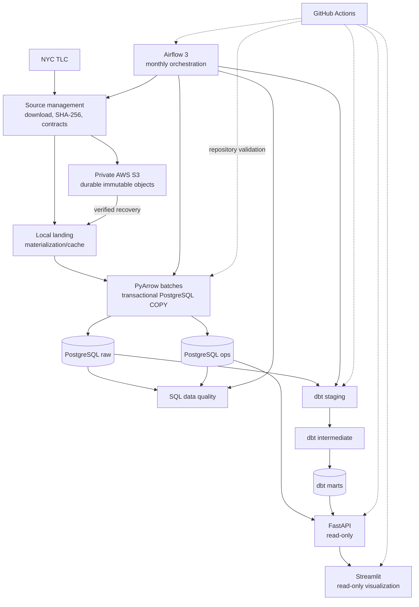

# Final platform architecture

## Ownership boundaries

| Component | Responsibility | Does not own |
|---|---|---|
| Python/Alembic | source handling, `raw`, `ops`, ingestion, quality | analytical transforms |
| dbt | `staging`, `intermediate`, `marts` | raw or operational state |
| Airflow | task ordering, scheduling, retries | pipeline business logic |
| FastAPI | read-only operations and aggregate analytics | orchestration or mutation |
| Streamlit | API-backed visualization | SQL access or pipeline control |
| S3 | durable immutable source objects | warehouse or operational data |

The DAG passes small identifiers and result summaries through XCom and invokes the same
application services used by the CLI. Source registration remains authoritative for
file-level idempotency; dbt remains authoritative for warehouse incrementality.

## Storage path

Local mode uses the deterministic landing path directly. S3 mode still validates through
a local temporary file, stores a checksum-addressed durable object, and materializes it
back to the same local path before the proven PyArrow/COPY loader runs. This keeps cloud
storage additive and preserves the local development path.

## Operational and analytics paths

`ops.pipeline_runs` records application ingestion attempts, including explicit skipped
reasons. Airflow's metadata database records orchestration runs; the two identities are
not conflated. FastAPI reads `ops.source_files`, `ops.pipeline_runs`, and
`ops.data_quality_results`, while aggregate analytics come from dbt-owned marts.
Streamlit has only `API_BASE_URL` and never receives database or AWS credentials.
